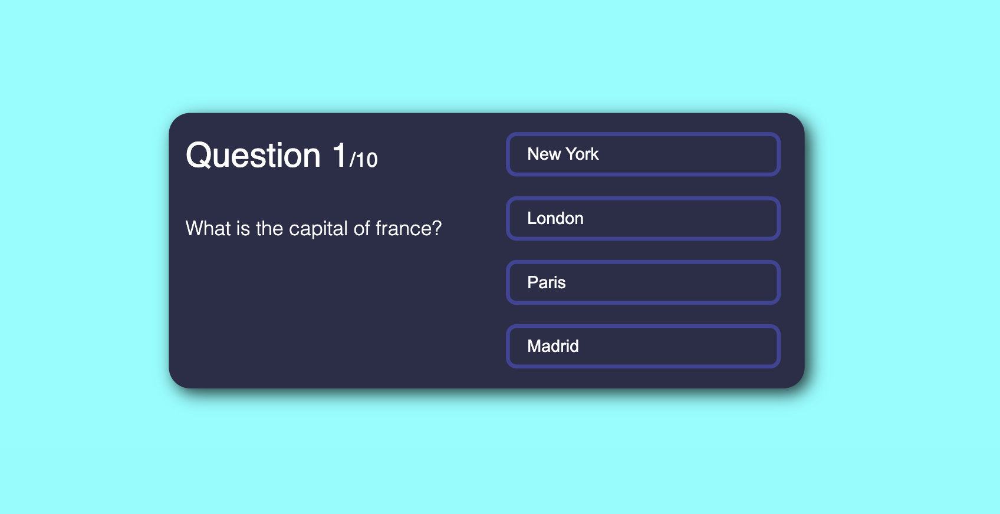
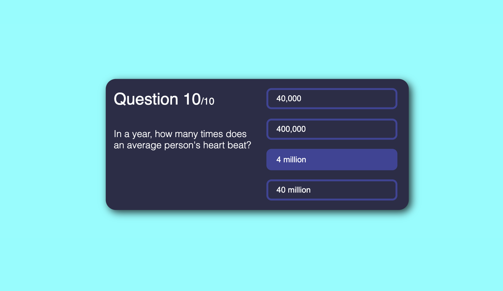
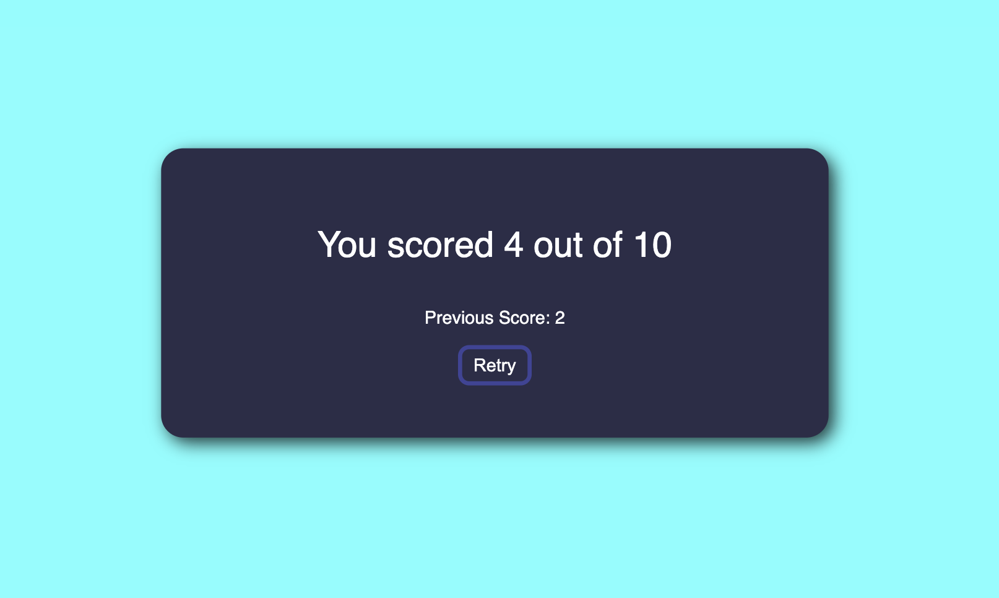

# THE GREAT QUIZ APP

In this project I build a simple quis using React js. Try answering the 10 set questions and see what score you get at the end. 

The questions, answers and their respective numbers will display dynamically.

Once you get to the end of the quiz, you'll be able to view your previous score and retry the quiz to try and beat it.

Good luck!

### SKILLS USED

- useState()
- ternary operators & conditional rendering
- creating a seperate react module for the quiz questions array
- exporting / importing the quiz questions array
- onClick event handlers
- if/else statements
- CSS styling
- displaying dynamic code
- resetting State

